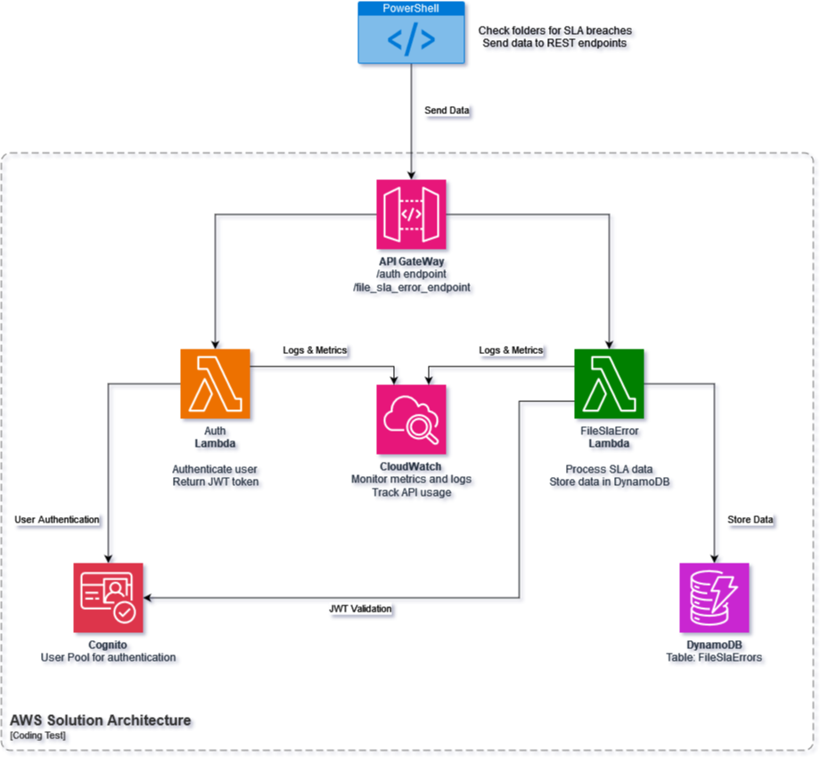
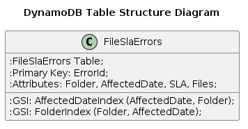

# Part 2 of the Coding Test: AWS Design

## Solution:

### AWS Solution Architecture Design

#### Overview
AWS serverless solution for processing data generated by a PowerShell script, handling user authentication, and storing data in DynamoDB. The solution leverages AWS Lambda, Amazon API Gateway, Amazon DynamoDB, and AWS Cognito, along with monitoring and metrics via Amazon CloudWatch.

#### Overall Architecture Diagram

#### Architecture Components

##### 1. AWS Lambda
AWS Lambda is used to execute the backend logic for the API endpoints. It enables the creation of serverless functions that run in response to events and automatically manage the compute resources required.

The primary Lambda functions are:
- **AuthLambda**: Handles user authentication using AWS Cognito and returns a JWT token.
- **FileSlaErrorLambda**: Processes incoming data from the PowerShell script and stores it in DynamoDB.

##### 2. Amazon API Gateway
Amazon API Gateway exposes RESTful API endpoints for the Lambda functions. It acts as the "front door" for applications to access data, business logic, or functionality from backend services.

The primary endpoints are:
- **/auth**: POST endpoint for user authentication.
- **/file_sla_error**: POST endpoint for ingesting data from the PowerShell script.

Configuration:
- Enable CORS to allow the PowerShell script to interact with the API.
- Configure request validation to ensure payload structure.
- Integrate with AWS Lambda functions for backend processing.

##### 3. AWS Cognito
AWS Cognito provides user authentication and authorization using JWT tokens. It offers a scalable user directory that can handle registration, authentication, and account recovery.
- **User Pool**: Manages user credentials and authentication.

##### 4. Amazon DynamoDB
Amazon DynamoDB is a fully managed NoSQL database service that provides fast and predictable performance with seamless scalability. It is used to store the data received from the PowerShell script.

###### DynamoDB Table Structure
- **Table Name**: FileSlaErrors
  This table is designed to store information about SLA breaches detected by a PowerShell script. Each record represents a single file that contributed to an SLA breach within a specific folder.

- **Primary Key**:
  - **Partition Key**: ErrorId (String, UUID format)
    This ensures each record has a unique identifier, allowing for precise retrieval and manipulation of individual records.

- **Attributes**:
  - **ErrorId** (String): Unique identifier for each error record, formatted as a UUID.
  - **Folder** (String): Identifier for the folder where the SLA breach occurred.
  - **AffectedDate** (String): Date and time when the SLA breach was detected, in ISO 8601 format.
  - **SLA** (Number): The SLA value in minutes or seconds that was breached.
  - **Files** (List): List of file objects, each containing:
    - **Filename** (String): Name of the file.
    - **CreationDate** (String): Creation date of the file, in ISO 8601 format.

- **Global Secondary Indexes (GSI)**:
  To support efficient querying by AffectedDate and Folder, the following GSIs are defined:
  - **Index Name**: AffectedDateIndex
    - **Partition Key**: AffectedDate (String)
    - **Sort Key**: Folder (String)
    - **Projection**: All attributes
  - **Index Name**: FolderIndex
    - **Partition Key**: Folder (String)
    - **Sort Key**: AffectedDate (String)
    - **Projection**: All attributes

###### Table Structure Diagram

###### Proposed Table Structure Summary
The FileSlaErrors table is designed to handle SLA breach records efficiently. The use of ErrorId as the primary key ensures each record is unique. The addition of two GSIs (AffectedDateIndex and FolderIndex) allows for efficient querying by AffectedDate and Folder, meeting the requirements for typical use cases. This structure is optimized for the operations and queries anticipated based on the exercise requirements.

##### 5. Amazon CloudWatch
Amazon CloudWatch is used for monitoring and logging the application, tracking metrics, and setting up alarms. It helps in understanding the application's performance and operational health.

- **Metrics**:
  - Invocation counts of Lambda functions.
  - Success and error rates of API calls.
  - Latency of API responses.

- **Dashboards and Alerts**:
  - Creating CloudWatch dashboards to visualize API usage and Lambda performance.
  - Set up CloudWatch Alarms to notify on specific conditions (e.g., high error rates, high latency).

#### Additional Considerations
- **Variables**:
  - AWS Secrets Manager could be used to store and manage variables/secrets securely.

- **Authorization and Data Protection**:
  - IAM roles and policies can be used to restrict access to resources.
  - API Gateway methods should be protected by resource policies and IAM roles.
  - Use of HTTPS for API Gateway to ensure secure data transmission.

[Go back to the Coding Test root](../)